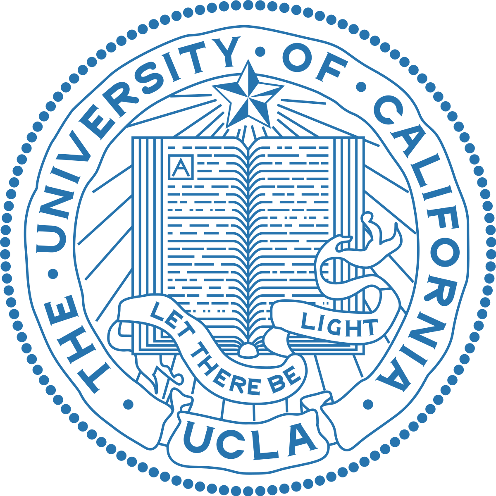
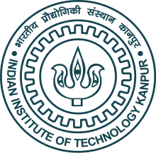

I am **Vijit Malik**, an **Applied Scientist II** at **Amazon**, where I focus on building **Rufus** for Conversational Shopping. Prior to joining Amazon, I completed my Bachelor's in Mechanical Engineering with Minors in Machine Learning from **IIT Kanpur**. My research has been published at top NLP conferences, including **ACL, NAACL, EMNLP, and EACL**. Currently, my research interests are centered on the *Trustworthiness of Deep Learning systems, Large Language Models, and Conversational AI*, with a particular focus on ensuring their reliability, fairness, and ethical application in real-world settings.

Prior to Amazon, my professional journey includes internship at **Observe AI**, before which I interned at **UCLA** (under [Prof. Kai-Wei Chang](http://web.cs.ucla.edu/~kwchang/) and [Prof. Nanyun Peng](https://vnpeng.net/)), and **IIT Kanpur** (under [Prof. Ashutosh Modi](https://ashutosh-modi.github.io/)), where I worked on diverse research challenges such as Legal AI, Fairness, Adversarial Attacks, and Structured Prediction. During my time at UCLA, I had the opportunity to work directly with the incredible [Dr. Sunipa Dev](https://sunipa.github.io/) (Senior Research Scientist, Google), who has been an invaluable mentor in my professional journey.

{: height="130px" width="130px" align="centre"}&nbsp;&nbsp;&nbsp;&nbsp;&nbsp;&nbsp;&nbsp;&nbsp;&nbsp;&nbsp;&nbsp;&nbsp;&nbsp;&nbsp;&nbsp;&nbsp;&nbsp;&nbsp;&nbsp;&nbsp;
{: height="130px" width="130px" align="centre"}&nbsp;&nbsp;&nbsp;&nbsp;&nbsp;&nbsp;&nbsp;&nbsp;&nbsp;&nbsp;&nbsp;&nbsp;&nbsp;&nbsp;&nbsp;&nbsp;&nbsp;&nbsp;
{: height="130px" width="130px" align="centre"}&nbsp;&nbsp;&nbsp;&nbsp;&nbsp;&nbsp;&nbsp;&nbsp;&nbsp;&nbsp;&nbsp;&nbsp;&nbsp;&nbsp;&nbsp;&nbsp;&nbsp;&nbsp;&nbsp;&nbsp;
{: height="130px" width="130px" align="centre"}&nbsp;&nbsp;&nbsp;&nbsp;&nbsp;&nbsp;&nbsp;&nbsp;&nbsp;&nbsp;&nbsp;&nbsp;&nbsp;&nbsp;\
&nbsp;&nbsp;&nbsp;&nbsp;&nbsp;&nbsp;&nbsp;&nbsp;&nbsp;&nbsp;**Amazon** &nbsp;&nbsp;&nbsp;&nbsp;&nbsp;&nbsp;&nbsp;&nbsp;&nbsp;&nbsp;&nbsp;&nbsp;&nbsp;&nbsp;&nbsp;&nbsp;&nbsp;&nbsp;&nbsp;&nbsp;&nbsp;&nbsp;&nbsp;&nbsp;&nbsp;&nbsp;&nbsp;&nbsp;&nbsp;&nbsp;&nbsp;&nbsp;&nbsp;&nbsp;&nbsp;&nbsp;&nbsp;&nbsp;&nbsp;&nbsp; **UCLA** &nbsp;&nbsp;&nbsp;&nbsp;&nbsp;&nbsp;&nbsp;&nbsp;&nbsp;&nbsp;&nbsp;&nbsp;&nbsp;&nbsp;&nbsp;&nbsp;&nbsp;&nbsp;&nbsp;&nbsp;&nbsp;&nbsp;&nbsp;&nbsp;&nbsp;&nbsp;&nbsp;&nbsp;&nbsp;&nbsp;&nbsp;&nbsp;&nbsp;&nbsp;&nbsp;&nbsp;              **Observe AI** &nbsp;&nbsp;&nbsp;&nbsp;&nbsp;&nbsp;&nbsp;&nbsp;&nbsp;&nbsp;&nbsp;&nbsp;&nbsp;&nbsp;&nbsp;&nbsp;&nbsp;&nbsp;&nbsp;&nbsp;&nbsp;&nbsp;&nbsp;&nbsp;&nbsp;&nbsp;&nbsp;&nbsp;&nbsp;&nbsp;&nbsp;&nbsp;&nbsp;&nbsp;   &nbsp;&nbsp;&nbsp;&nbsp;            **IITK**

News
======
* **5th Nov 2024 :airplane:**: Presenting our works PEARL and CorrSynth at EMNLP'24, see you in Miami, FL!
* **10th Oct 2024 :boom:**: Two papers accepted at EMNLP'24, congratulations to my co-authors on the amazing work!
* **21st Sep 2024 :airplane:**: Presenting our work on Natural Language Interface for Product Search at CIKM'24 in Boise, ID!
* **25th Aug 2024 :airplane:**: Presenting our work 'PEARL' at AMLC'24 in Seattle, WA!
* **17th Aug 2024 :boom:**: One paper "Building Natural Language Interface for Product Search" accepted at CIKM'24 in Boise, ID!

Publications
=============



  <!-- Image Section -->
  

    
  

  <!-- Details Section -->
  

    
<a href="{{ pub.link }}" target="_blank">{{ pub.title }}</a>

    
<strong>Authors:</strong> {{ pub.authors }}

    
<strong>Published in:</strong> {{ pub.venue }} ({{ pub.year }})

  



